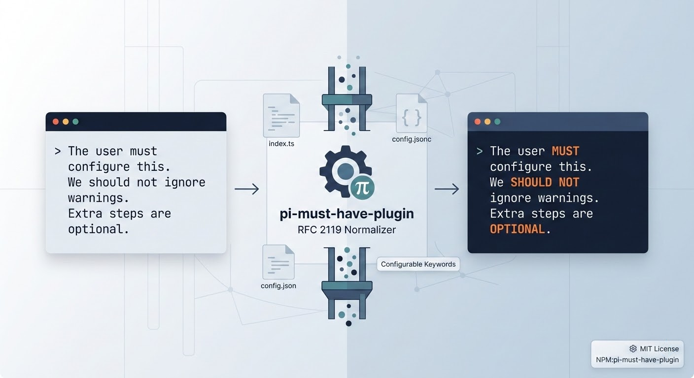

# pi-must-have-plugin

Normalize RFC 2119 language in Pi prompts by automatically rewriting lowercase modal terms (for example `must`, `should not`, `optional`) into uppercase normative forms (`MUST`, `SHOULD NOT`, `OPTIONAL`).

## Origin

This extension originated from the OpenCode plugin project: [ariane-emory/MUST-have-plugin](https://github.com/ariane-emory/MUST-have-plugin).

`pi-must-have-plugin` is a Pi-harness adaptation of that original plugin, converted into a modular TypeScript Pi extension.

## Preview

<p>
  
</p>

https://github.com/user-attachments/assets/22149125-8976-4d06-98cb-e7cfa180476d

If GitHub does not render the video inline, open/download it directly from [`asset/demo.mp4`](asset/demo.mp4).

## Features

- Rewrites configurable keywords during normal prompt input.
- Case-insensitive matching with longest-first phrase replacement.
- Word-boundary-aware matching (does not replace inside larger words).
- Leaves slash commands and shell-prefixed input unchanged.
- Supports JSONC config (`// comments`, `/* blocks */`, trailing commas).
- Auto-creates a default config when none exists.
- Supports legacy config path migration warnings.
- Optional debug notifications in Pi TUI with replacement count/details in console logs.

## Installation

### Local extension folder

Copy this repository to:

- Global: `~/.pi/agent/extensions/pi-must-have-plugin`
- Project: `.pi/extensions/pi-must-have-plugin`

Pi will auto-discover it.

### NPM package

```bash
pi install npm:pi-must-have-plugin
```

## Configuration

Runtime config path:

```text
~/.pi/agent/extensions/pi-must-have-plugin/config.jsonc
```

Legacy fallback paths (read-only fallback):

```text
~/.pi/agent/extensions/must-have-plugin/config.jsonc
~/.config/opencode/MUST-have-plugin.jsonc
```

Example config template is included at `config/config.example.jsonc`.

```jsonc
{
  "debug": false,
  "replacements": {
    "must": "MUST",
    "must not": "MUST NOT",
    "should": "SHOULD"
  }
}
```

An advanced replacement sample adapted from the original plugin is also included at:

```text
config/replacements.custom-sample.jsonc
```

You can copy selected entries from that sample into your runtime `config.jsonc`.

## Development

```bash
npm install
npm run build
npm run lint
npm run test
npm run check
```

## Project Structure

- `index.ts` - Pi auto-discovery entrypoint.
- `src/index.ts` - extension event wiring.
- `src/config/` - config loading and JSONC parsing.
- `src/replacements/` - replacement and input-skip engine.
- `src/constants.ts` - extension constants and defaults.
- `src/types.ts` - shared types.
- `test/` - Node test suite.
- `config/config.example.jsonc` - starter config template.
- `config/replacements.custom-sample.jsonc` - advanced custom replacement sample.
- `asset/` - README media (overview image and demo video).

## License

MIT
